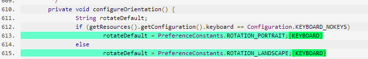
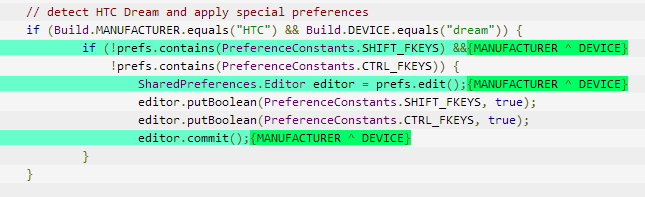
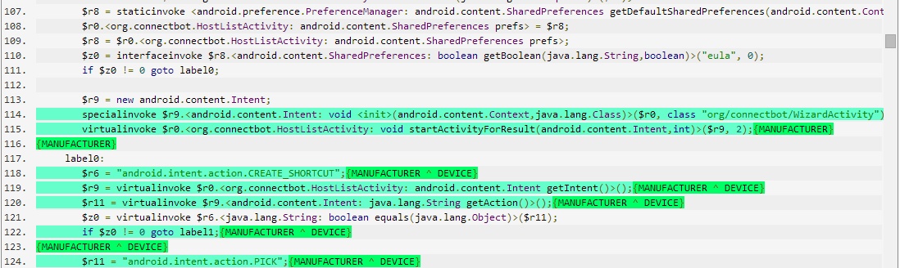

Lotrack
=========

Tracking Load-time Configuration Options

## Abstract ##

Highly-configurable software systems are pervasive, although configuration options and their interactions raise complexity of the program and increase maintenance effort. Especially load-time configuration options, such as parameters from command-line options or configuration files, are used with standard programming constructs such as variables and if statements intermixed with the program’s implementation; manually tracking configuration options from the time they are loaded to the point where they may influence control-flow decisions is tedious and error prone. We design and implement Lotrack, an extended static taint analysis to automatically track configuration options. Lotrack derives a configuration map that explains for each code fragment under which configurations it may be executed. An evaluation on Android applications shows that Lotrack yields high accuracy with reasonable performance. We use Lotrack to empirically characterize how much of the implementation of Android apps depends on the platform’s configuration options or interactions of these options.

## Authors ##

Max Lillack

[Christian Kästner](www.cs.cmu.edu/~ckaestne/)

[Eric Bodden](http://www.bodden.de)

## Screenshots ##

Combination of Features (Mapping Jimple->Java not perfect)

Same example in Jimple

## Projects ##
[Soot](soot-modmax) (forked from https://github.com/Sable/soot)

[soot-infoflow](soot-infolow) (forked from https://github.com/secure-software-engineering/soot-infoflow)

[soot-infoflow-android](soot-infoflow-android) (forked from https://github.com/secure-software-engineering/soot-infoflow-android)

[SPLLift_neu](spllift) (forked from https://github.com/secure-software-engineering/SPLlift)

[heros](heros) (IFDS/IDE solver, forked from https://github.com/Sable/heros)

[loadtime-gui](loadtime-gui) (Used to display configuration map)

soot-infoflow and soot-infoflow-android are part of [FlowDroid](http://sseblog.ec-spride.de/tools/flowdroid/).

## Evaluation ##

[Selected Apps from FDroid](Evaluation/selected.txt)

[Guideline document](Evaluation/Manual App Review Guidelines.pdf)

[Result Document](Evaluation/Evaluation_10Apps_Result.pdf) 

[Result Data (MongoDB dump, for use with loadtime-gui](Evaluation/MongoDB dump.zip)

[Performance Result](Evaluation/performance.xml)

[Script to randomly select apps from FDroid](Evaluation/selectFromFDroid.py)

[Considered repository (full set at time of evaluation)](Evaluation/FDroidLinks.txt)

Thanks to the [FDroid](https://f-droid.org/) project.
